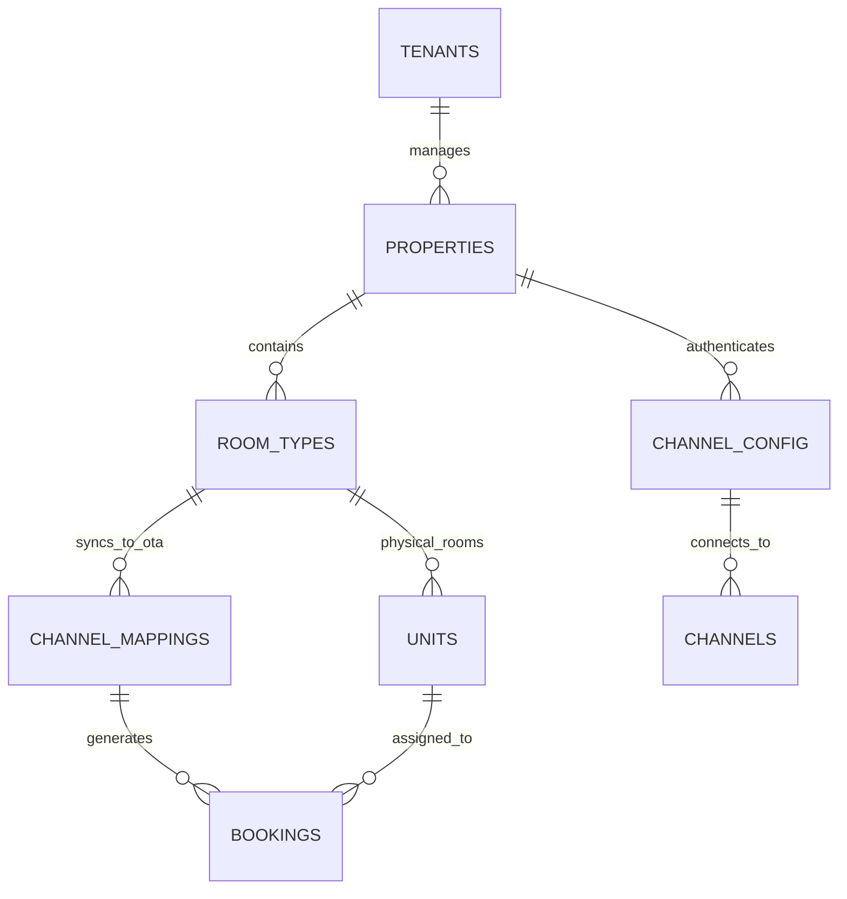

# 🗄️ Schéma Base de Données : Synchronisation Channel Manager & PMS

Ce schéma représente l'architecture SQL prévue pour **Supabase (PostgreSQL)** permettant de supporter la complexité de routage entre HostedFlow, les Hubs API (Channex.io) et les plateformes OTA.

## 1. Principes de Conception (HOT vs PRO)
- **PMS HOT (Villa/Appartement)** : Une propriété = Une unité physique. La réservation bloque automatiquement la totalité.
- **PMS PRO (Hôtel)** : Une propriété = Des types de chambres (`Room Types`), qui eux-mêmes contiennent X `Units` (Les numéros de portes 101, 102, 103). Le Channel Manager pousse de l'inventaire en fonction du *Room Type*, non de l'unité physique (sauf pour certains OTA). L'assignation de porte est dynamique.

## 2. Diagramme Logique (Textuel)



## 3. Définition des Tables SQL (Détails Supabase)

### Table `properties` (Hôtel ou Villa)
Sert d'ancre (Établissement physique complet ou Villa complète).
```sql
CREATE TABLE properties (
  id UUID PRIMARY KEY DEFAULT uuid_generate_v4(),
  tenant_id UUID REFERENCES tenants(id),
  name VARCHAR(255) NOT NULL,
  type VARCHAR(50) NOT NULL, -- Enum: 'Hotel' (PRO), 'Villa', 'Apartment' (HOT)
  timezone VARCHAR(100),
  api_hub_property_id VARCHAR(255) -- Ex: L'ID interne chez Channex.io associé à ce bâtiment
);
```

### Table `room_types` (Groupes d'inventaire)
Les OTAs (Booking.com) s'intéressent aux "Types de Chambre", pas au numéro de porte.
```sql
CREATE TABLE room_types (
  id UUID PRIMARY KEY DEFAULT uuid_generate_v4(),
  property_id UUID REFERENCES properties(id),
  name VARCHAR(255) NOT NULL, -- ex: "Suite Deluxe Vue Mer"
  base_capacity INT DEFAULT 2,
  base_price DECIMAL,
  api_hub_room_type_id VARCHAR(255) -- ID de la RoomType sur le Hub Channex
);
```

### Table `units` (Chambres Physiques / L'IoT)
Pour le PMS, c'est la véritable clé qui sera envoyée à la serrure connectée (IoT).
```sql
CREATE TABLE units (
  id UUID PRIMARY KEY DEFAULT uuid_generate_v4(),
  room_type_id UUID REFERENCES room_types(id),
  name VARCHAR(50) NOT NULL, -- ex: "Chambre 104"
  status VARCHAR(20) DEFAULT 'Clean', -- Clean, Dirty, Maintenance
  ttlock_lock_id VARCHAR(255) -- L'ID de la serrure physique TTLock attachée à cette porte
);
```
> [!NOTE]
> En mode **PMS HOT (Villa)**, il y a exactement 1 `room_type` et 1 `unit` cachés sous la Propriété pour simplifier le flux, mais l'architecture backend reste stricte et professionnelle.

### Table `channel_config` (Clés / OAuth du Client)
Stocke les autorisations API pour un OTA spécifique (Airbnb OAuth, Booking Extranet).
```sql
CREATE TABLE channel_config (
  id UUID PRIMARY KEY,
  property_id UUID REFERENCES properties(id),
  channel_slug VARCHAR(50) NOT NULL, -- 'airbnb', 'booking', 'vrbo'
  status VARCHAR(20) DEFAULT 'inactive', -- 'active', 'sandbox'
  credentials_jsonb JSONB, -- AES-Encrypted Tokens / OAuth Refresh Tokens
  hub_connection_id VARCHAR(255) -- L'identifiant de cette connexion dans Channex
);
```

### Table `channel_mappings` (Le traducteur)
Fait le lien final. Dit au Hub : "Ma Suite Deluxe = ID_Airbnb_xyz123".
```sql
CREATE TABLE channel_mappings (
  id UUID PRIMARY KEY,
  room_type_id UUID REFERENCES room_types(id),
  channel_config_id UUID REFERENCES channel_config(id),
  ota_listing_id VARCHAR(255) NOT NULL, -- L'ID de l'annonce sur Airbnb ou Booking
  rate_plan_id VARCHAR(255),
  sync_dispo BOOLEAN DEFAULT true,
  sync_rates BOOLEAN DEFAULT true,
  markup_percentage DECIMAL DEFAULT 0 -- Possibilité d'augmenter le prix de +15% sur Booking auto
);
```

### Table `bookings` (Le résultat final)
Le Hub API enverra un webhook générant une entrée ici.
```sql
CREATE TABLE bookings (
  id UUID PRIMARY KEY DEFAULT uuid_generate_v4(),
  channel_mapping_id UUID REFERENCES channel_mappings(id), -- Optionnel si réservation directe
  unit_id UUID REFERENCES units(id), -- Assigné automatiquement ou manuellement au FrontDesk
  guest_name VARCHAR(255),
  check_in TIMESTAMPTZ,
  check_out TIMESTAMPTZ,
  total_price DECIMAL,
  status VARCHAR(50), -- 'confirmed', 'cancelled'
  ota_reservation_code VARCHAR(255) UNIQUE, -- PRN booking (ex: BKG-19827391)
  iot_pin_code VARCHAR(20) -- Le code TTLock généré pour cette résa
);
```
