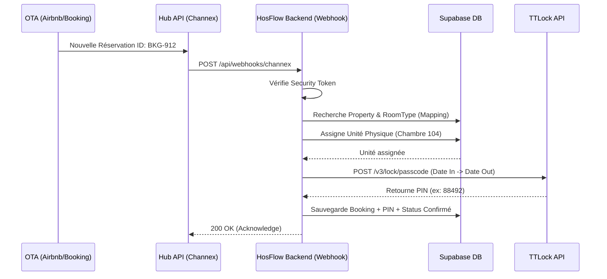

# ⚙️ Logique de Synchronisation Webhook (Channel Hub -> PMS -> IoT)

Ce document détaille la logique d'intégration backend (Node.js/Edge Functions) servant de pont entre le Hub API externe (ex: Channex.io) et l'écosystème HosFlow (Base de données, Calendrier, et Serrures Connectées).

## 1. Flux Architecturel Global



## 2. Exemple de Logique Webhook (Node.js / Express)

Ce contrôleur gère la réception sécurisée des réservations, l'enregistrement en base, et le déclenchement de l'automatisation matérielle (IoT).

```javascript
import { createClient } from '@supabase/supabase-js';
import axios from 'axios';

// Initialisation Base de données
const supabase = createClient(process.env.SUPABASE_URL, process.env.SUPABASE_SERVICE_ROLE_KEY);

export async function handleHubWebhook(req, res) {
  try {
    const payload = req.body;
    const { event_type, data } = payload;

    // 1. Acknowledgment immédiat (requis par Channex.io sous 3 secondes)
    res.status(200).send('Received');

    if (event_type !== 'booking.created') return;

    // 2. Extraire la réservation entrante
    const { 
      property_id, 
      room_type_id, 
      guest, 
      arrival_date, 
      departure_date, 
      ota_reservation_code,
      channel_id
    } = data.booking;

    // 3. Assigner l'unité physique (Logique d'allocation PMS Pro vs Hot)
    // En PMS Hot (Villa), une seule unité existe. En PMS Pro, on cherche une chambre propre et vide.
    const { data: units } = await supabase
      .from('units')
      .select('id, ttlock_lock_id')
      .eq('room_type_id', room_type_id)
      .eq('status', 'Clean')
      .limit(1) // Pour l'algorithme "First Available"
      .single();

    if (!units) {
      console.warn("ALERTE: Sur-réservation ou aucune unité propre disponible. Assignation retardée.");
      // Logique fallback : Enregistrer sans unité, notifier la réception.
    }

    let iotPinData = null;

    // 4. Déclenchement de l'Accès Intelligent (IoT TTLock)
    if (units?.ttlock_lock_id) {
       iotPinData = await generateSmartLockAccess({
         lockId: units.ttlock_lock_id,
         startTime: arrival_date, // Timestamp Unix d'arrivée + paramètre d'heure de check-in de l'hôtel
         endTime: departure_date, // Timestamp Unix de départ + heure de check-out
         guestName: guest.name
       });
    }

    // 5. Sauvegarde Finale dans HostedFlow PMS
    await supabase.from('bookings').insert({
      unit_id: units?.id || null,
      channel_mapping_id: channel_id,
      guest_name: guest.name,
      check_in: arrival_date,
      check_out: departure_date,
      ota_reservation_code,
      iot_pin_code: iotPinData?.keyboardPwd || null,
      status: 'confirmed'
    });

    // 6. Tâches asynchrones secondaires
    // -> Envoyer un WhatsApp au client avec le PIN
    // -> Envoyer un Email de confirmation
    console.log(`Réservation ${ota_reservation_code} traitée avec succès. PIN: ${iotPinData?.keyboardPwd}`);

  } catch (error) {
    console.error("Erreur critique sur Webhook:", error);
    // Un système de "Retry" ou une alerte Sentry doit être appelé ici.
  }
}

/**
 * Appel API vers le cloud TTLock
 */
async function generateSmartLockAccess({ lockId, startTime, endTime, guestName }) {
  // Documentation TTLock: https://open.ttlock.com/doc/api/v3/keyboardPwd/get
  const response = await axios.post('https://api.ttlock.com/v3/keyboardPwd/get', {
    clientId: process.env.TTLOCK_CLIENT_ID,
    accessToken: process.env.TTLOCK_ACCESS_TOKEN, // Devrait être récupéré dynamiquement par tenant
    lockId: lockId,
    keyboardPwdType: 3, // 3 = Time-limited passcode
    startDate: Date.parse(startTime), 
    endDate: Date.parse(endTime),
    keyboardPwdName: `Booking: ${guestName}`
  });

  return response.data; // { keyboardPwd: "18392", keyboardPwdId: 4492 }
}
```

## 3. Gestion des Tests (Mode Sandbox)

En **Mode Sandbox** (paramétré dans l'UI du PMS), le payload sortant vers le `Hub API` ou les tests de création de réservation ne tapent pas sur les systèmes primaires :
- `channex_url_base` bascule de `https://app.channex.io/api/v1/` vers le namespace de test Channex.
- Le webhook skip l'appel API `https://api.ttlock.com/` et génère simplement un nombre pseudo-aléatoire pour la démonstration au client.
